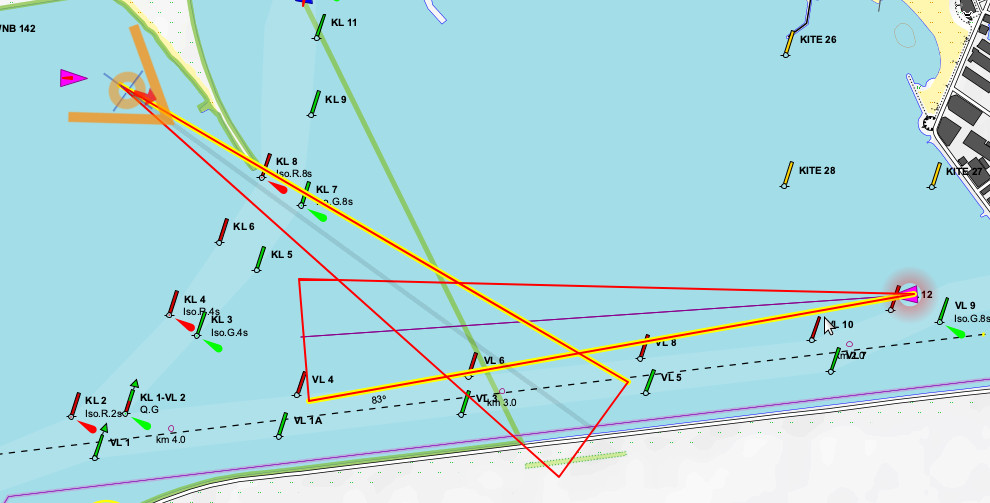

[Русское описание](https://github.com/VladimirKalachikhin/collision-detector/blob/master/README.ru-RU.md)  
# collision-detector 
SignalK server plugin that detects a  risk of collision with other vessels.

<a href='https://github.com/VladimirKalachikhin/Galadriel-map/discussions'>Forum</a>

## v. 0.2
The plugin tries to determine the possibility of a collision according to the adopted collision model based on the specified detection distance and the probability of deviations from the course.  

 

The plugin raise a [SignalK `notifications.danger.collision`](https://signalk.org/specification/1.7.0/doc/notifications.html) alarm with a list of uuid of vessels that have a risk of collision. Other software can inform the navigator of dangers. For example, the [GaladrielMap](https://www.npmjs.com/package/galadrielmap_sk) highlights such vessels on the map and indicates the direction to them on self cursor.  

**No information issued or not issued by the plugin can be the basis for the actions or inaction of the navigator.**  

Be careful.

## Usage
* Subscribe to `"path": "notifications.danger.collision"` as it described in [Subscription Protocol](https://signalk.org/specification/1.7.0/doc/subscription_protocol.html) document.   

* Read the delta stream for 
>
<pre>
    "value": {  
        "method": ["visual", "sound"],  
        "state": "alarm",  
        "message": "Collision danger!"  
        "vessels": {  
            "vessels.urn:mrn:imo:mmsi:123456789":{"lat":..., "lon":..., "dist":..., "bearing":...},  
            ...  
        },  
    },
</pre>

The "value.vessels" is an array of uuid and positions of dangerous vessels.

## Install&configure:
Install this plugin from SignalK Appstore as **collision-detector** in the usual way.  
Restart SignalK,  
Use Server -> Plugin Config menu of SignalK web control panel to start plugin and configure detection distance and timeouts.  
Press Submit to save changes.  

## Support
[Discussions](https://github.com/VladimirKalachikhin/Galadriel-map/discussions)

The forum will be more lively if you make a donation at [ЮMoney](https://sobe.ru/na/galadrielmap)

[Paid personal consulting](https://kwork.ru/it-support/20093939/galadrielmap-installation-configuration-and-usage-consulting)  
