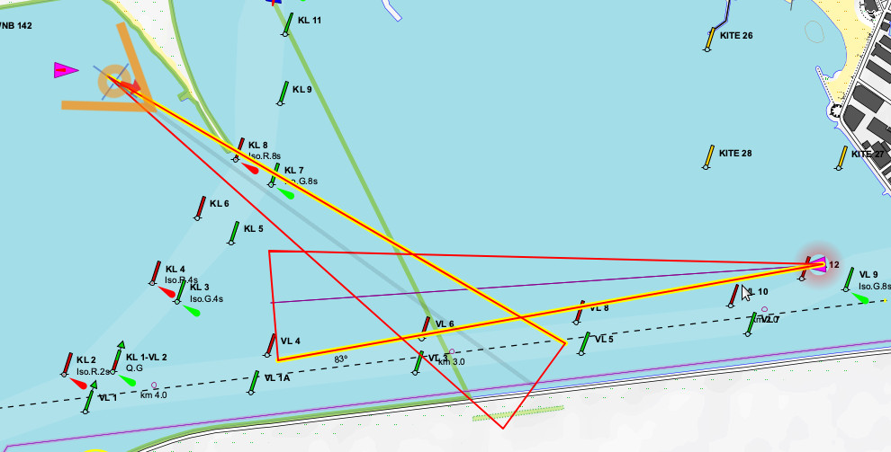

[In English](https://github.com/VladimirKalachikhin/collision-detector/blob/master/README.md)  
# collision-detector 
Серверный плагин для SignalK, обнаруживающий опасность столкновения с другими судами.

<a href='https://github.com/VladimirKalachikhin/Galadriel-map/discussions'>Форум</a>

## v. 0.2

Плагин пытается обнаружить опасность столкновения с другими судами, известными SignalK, на основе принятой модели риска, использующей указанную пользователем дистанцию обнаружения опасности и вероятность отклонений от текущего курса.

 

Плагин инициирует событие `notifications.danger.collision` [системы оповещений SignalK ](https://signalk.org/specification/1.7.0/doc/notifications.html), так что какое-то программное обеспечение, реагирующее на это событие, может информировать судоводителя об опасности.  
Например, картплотер [GaladrielMap](https://www.npmjs.com/package/galadrielmap_sk) обозначает потенциально опасные суда значком на карте, и одновременно рисует стрелку в направлении опасности внутри значка, указывающего собственное положение.  

**Внимание! Никакая информация, выданная или не выданная этим плагином, не может служить основанием для действия или бездействия судоводителя.**   

Будьте осторожны.

## Использование
* В своей программе подпишитесь на `"path": "notifications.danger.collision"` как это описано в документе [Subscription Protocol](https://signalk.org/specification/1.7.0/doc/subscription_protocol.html).  
* Читайте сдедующие значения в потоке изменений delta:
>
<pre>
    "value": {  
        "method": ["visual", "sound"],  
        "state": "alarm",  
        "message": "Collision danger!"  
        "vessels": [  
            "vessels.urn:mrn:imo:mmsi:123456789":{"lat":..., "lon":..., "dist":..., "bearing":...},  
            ...  
        ],  
    },
</pre>

Переменная "value.vessels" содержит массив из uuid и координат потенциально опасных судов.  

## Установка и конфигурирование
Установите плагин с помощью веб-панели SignalK из Appstore обычным образом как **collision-detector**.  
Перезапустите сервер SignalK.  
В меню Server -> Plugin Config настройте запуск приложения, дистанцию обнаружения и таймауты.  
Нажмите Submit для сохранения изменений.

## Поддержка
[Форум](https://github.com/VladimirKalachikhin/Galadriel-map/discussions)

Форум будет живее, если вы сделаете пожертвование на [ЮМани](https://sobe.ru/na/galadrielmap).

Вы можете получить [индивидуальную платную консультацию](https://kwork.ru/training-consulting/20093293/konsultatsii-po-ustanovke-i-ispolzovaniyu-galadrielmap).

